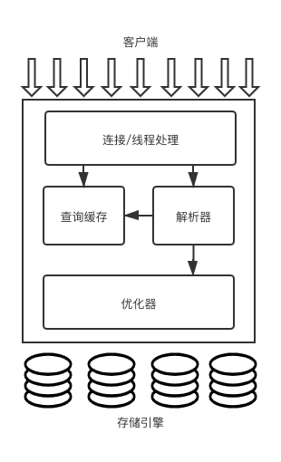

## MySQL 逻辑架构


* 最上层的服务并非 MySQL 独有，大多数基于网络的客户端/服务器的工具或者服务都有类似的架构。比如连接处理、授权认证、安全等。

* 第二层架构是大多数 MySQL 的核心服务功能所在的一层，包括查询解析、分析、优化、缓存以及所有的内置函数（日期、时间、数字和加密函数等），所有跨存储引擎的功能都在这一层实现：存储过程、触发器、视图等。

* 第三层包含了存储引擎。存储引擎负责 MySQL 中数据的存储和提取。每个存储引擎都有它的优势和劣势。服务器通过 API 与存储引擎进行通信。这些接口屏蔽了不同存储引擎之间的差异，使得这些差异对上层的查询过程透明。存储引擎不会去解析 SQL（*InnoDB 是个例外，它会解析外键定义，因为 MySQL 服务器本身没有实现该功能*），不同存储引擎之间也不会相互通信，而只是简单的响应上层服务器的请求。

### 连接管理与安全性
每个客户端连接都会在服务器进程中拥有一个线程，这个线程的查询只会在这个单独的线程中执行，该线程只能轮流在某个 CPU 核心或者 CPU 中运行。服务器会负责缓存线程，因此不需要为每一新建的连接创建或者销毁线程（*MySQL 5.5或者以后的版本提供了一个 API，支持线程池插件，可以使用池中少量的线程来服务大量的连接*）。

当客户端连接到 MySQL 服务器时，服务器需要对其进行认证。认证基于用户名、原始主机信息和密码。如果使用了 SSL 的方式连接，还可以使用 X.509 证书认证。当连接成功，服务器会继续验证该客户端是否具有执行某个特定查询的权限。

### 优化和执行
MySQL 会解析查询，并创建内部数据结构（解析树），然后对其优化，包括重写查询、决定表的读取顺序，以及选择合适的索引等。用户可以通过特殊的关键字提示（hint）优化器，影响这一决策过程。也可以请求优化器解释（explain）优化过程的各个因素，使用户可以知道服务器是如何进行优化决策的，并提供一个参考基准，便于用户重构查询和 schema、修改相关配置，使应用尽可能高效运行。

优化器不关心表使用的使什么存储引擎，但存储引擎对于优化查询是有影响的。

对于 SELECT 语句，在解析优化之前，服务器会先检查查询缓存（Query Cache）。

## 并发控制

### 读写锁
在处理并发读或者写时，可以通过实现一个由两种类型的锁组成的锁系统解决问题。这两种类型的锁通常被称为共享锁（shared lock）和排它锁（exclusive lock），也叫读锁（read lock）和写锁（write lock）。
**锁的概念**
读锁是共享的，或者说是相互不阻塞的。多个客户在同一时刻可以同时读取同一个资源，而互不干扰。
写锁则是排他的，一个写锁会阻塞其他的写锁和读锁。

### 锁粒度
一种提高共享资源并发性的方式就是让锁定对象更具有选择性。尽量只锁定需要修改的部分数据，而非所有的资源。任何时候，在给定资源上，锁定的数据量越少，则系统的并发程度越高，只要相互之间不发生冲突即可。

**锁策略**
锁策略就是在锁的开销和数据的安全性之间寻求平衡，这种平衡也会影响到性能。每种 MySQL 存储引擎都可以实现自己的锁策略和锁粒度。

#### 表锁（table lock）
表锁是 MySQL 中最基本的锁策略，并且开销最小策略。

一个用户在对表进行操作（insert、delete、update 等）前，需要先获得写锁，这会阻塞其他用户对该表进行的所有读写操作。只有没有写锁时，其他读取的用户才能获得读锁，读锁之间不会相互阻塞。

在一些场景中表锁也能具有良好的性能，例如，READ LOCAL 表锁支持某些类型的并发写操作。

#### 行级锁
行级锁可以最大程度地支持并发处理，但这同时带来最大的锁开销。在 InnoDB 和 XtraDB，以及其他一些存储引擎中实现了行级锁。行级锁只在存储引擎层实现，而 MySQL 服务层没有实现。

## 事务
**事务就是一组原子性的 SQL 查询，或者说一个独立的工作单元。**事务内的语句要么全部成功，要么全部失败。

**ACID**
* 原子性（atomicity）：一个事务必须被视为一个不可分割的最小工作单元，整个事务中所有的操作要么全部提交成功，要么全部失败回滚，对于事务来说，不可能只执行其中一部分。
* 一致性（consistency）：数据库中是从一个一致性的状态转换到另一个一致性的状态。
* 隔离性（isolation）：“通常来说”（隔离级别），一个事务所做修改在最终提交之前，对其他事务是不可见的。
* 持久性（durability）：一旦事务提交，则其所做的修改将永久保存到数据库中。

### 隔离级别
**READ UMCOMMITED（未提交读）**：在此级别，事务中的修改，即使没有提交，对其他事务也都是可见的。事务可以读取未提交的数据，这也被称为**脏读（Dirty Read）**。在性能上，READ UNCOMMITTED 不会比其他的级别好太多，但却缺乏他的级别的很多好处，除非真的有非常必要的理由。
**READ COMMITTED（提交读）**：大多数数据库系统的默认隔离级别都是 READ COMMITTED（但 MySQL 不是）。当一个事务开始时，只能对已经提交的事务所做的修改可见。也就是，一个事务从开始直到提交之前，所做的任何修改对其他的事务都是不可见的。这个级别也叫做**不可重复读（nonrepeatable read）**，因为两次执行同样的查询，可能会得到不同的结果。
**REPEATABLE READ（可重复读）**：可重复读解决了脏读的问题。该级别保证了同一个事务中多次读取同样记录的结果是一致的。但是，可重复读隔离级别无法解决另一个**幻读（Phantom Read）**的问题。幻读指的是当某个事务在读取某个范围内的数据时，另一个事务又在该范围内插入了新的记录，当之前的事务再次读取该范围内的记录时，会产生**幻行（Phantom Row）**。InnoDB 和 XtraDB 存储引擎通过**多版本并发控制（MVCC）**解决了幻读的问题。可重复读是 MySQL 的默认事务隔离级别。
**SERIALIZABLE（可串行化）**：可串行化是最高隔离级别，通过强制事务串行执行，避免了幻读的问题。可串行化会在读取的每一行数据上都加锁，所以可能导致大量的超时和锁争用的问题。只有在非常需要确保数据的一致性并且可以接受没有并发的情况下，才考虑使用此级别。
|隔离级别|脏读可能性|不可重复读可能性|幻读可能性|加锁读|
|----|----|----|----|----|----|
|READ UNCOMMITTED|✅|✅|✅|❌|
|READ COMMITTED|❌|✅|✅|❌|
|REPEATABLE READ|❌|❌|✅|❌|
|SERIALIZABLE|❌|❌|❌|✅|

### 死锁
死锁是指两个或者多个事务在同一资源上项目占用，并请求锁定对方占用的资源，从而导致恶性循环的现象。当多个事务试图以不同的顺序锁定资源时，就可能产生死锁。多个事务同时锁定同一资源时，也可能产生死锁。

为了解决因为死锁而陷入死循环，数据库系统实现了各种死锁检查和死锁超时机制。InnoDB 目前处理死锁的方法是，将持有最少行级排他锁的事务进行回滚。

### 事务日志
事务日志可以帮助提高事务的效率。使用事务日志，存储引擎在修改表的数据时只需要修改其内存拷贝，再把该修改行为记录到持久在硬盘上的事务日志中，而不用每次都将修改的数据本身持久到磁盘。

### MySQL 中的事务
MySQL 提供了两种事务性的存储引擎：InnoDB 和 NDB Cluster。另外还有一些第三方存储引擎也支持事务，比如 XtraDB 和 PBXT。

#### 自动提交（AUTOCOMMIT）
MySQL 默认采用自动提交模式。也就是，如果不显式地开始一个事务，则每个查询都被当做一个事务执行提交操作。在当前连接中，可以通过设置 AUTOCOMMIT 变量来启用或禁用自动提交模式
``` sql
mysql> SHOW VARIABLES LIKE 'AUTOCOMMIT';
mysql> SET AUTOCOMMIT = 1;
```
当禁用自动提交时，所有的查询都是在一个事务中，直到显式地执行 COMMIT 或者 ROLLBACK，该事务结束，同时又开始了另一个新事务。